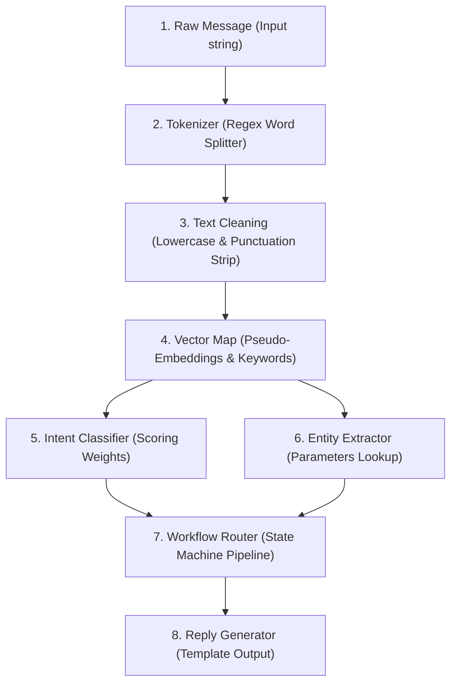

# Inside the Chatbot's Brain: NLP Code Breakdown

This document provides a detailed technical breakdown of the offline Natural Language Processing (NLP) simulation engine running inside **[app.js](app.js)**. 

While modern LLMs process text in a single step using billions of neural network weights, traditional NLP systems use a **modular pipeline**. This open-source resource simulates that pipeline step-by-step using front-end JavaScript.

---

## 🗺️ Pipeline Architecture

Here is how user text flows through the chatbot's processing engine:



---

## 🛠️ Step-by-Step Code Mechanics

### 1. The Incoming Stream
The engine receives the raw text message exactly as typed by the user in the input area:
```javascript
const rawText = message; // "Hi, I want to join the event tomorrow."
```

### 2. Tokenization (Splitting Text)
The tokenizer cuts the text into separate strings called **tokens** (words and punctuation marks). It uses a regular expression to match either words (`\w+`) or punctuation symbols (`[^\w\s]+`):
```javascript
const regexTokens = message.match(/\w+|[^\w\s]+/g) || [];
// Output: ["Hi", ",", "I", "want", "to", "join", "the", "event", "tomorrow", "."]
```

### 3. Normalization & Cleaning
To prevent capitalization and punctuation from breaking matching rules, the engine standardizes the tokens. It converts letters to lowercase and flags punctuation for removal:
```javascript
regexTokens.forEach(token => {
  const hasPunctuation = /^[^\w\s]+$/.test(token);
  let clean = token.toLowerCase();
  
  if (hasPunctuation) {
    clean = ""; // Marks for removal
  }
  // Standardized tokens are accumulated
});
// Output: "hi i want to join the event tomorrow"
```

### 4. Vector Mappings (Words to Numbers)
The engine converts cleaned words into coordinates called **Vectors** (or **Embeddings**). Words defined in our vocabulary dictionary are assigned specific float vectors, while new words generate deterministic coordinates dynamically based on their character codes:
```javascript
// Dictionary sample
const wordDictionary = {
  "join": { embed: [0.12, 0.84, 0.31], category: "Verb" },
  "event": { embed: [0.45, 0.18, 0.92], category: "Noun" }
};

// Deterministic hash fallback for unknown words
let h1 = 0, h2 = 0, h3 = 0;
for (let i = 0; i < word.length; i++) {
  const charCode = word.charCodeAt(i);
  h1 = (h1 * 31 + charCode) % 100;
  h2 = (h2 * 37 + charCode) % 100;
}
const vector = [h1 / 100, h2 / 100, h3 / 100];
```

### 5. Intent Classification (What does the user want?)
The engine checks the tokens list against arrays of keyword weights to calculate a confidence score for three main intents: **Registration**, **Pricing**, and **Location**:
```javascript
const registrationKeywords = ["join", "register", "attend", "signup"];
const pricingKeywords = ["cost", "price", "fee", "pay", "ticket"];
const locationKeywords = ["where", "location", "address", "venue", "map"];

let regScore = 0, prcScore = 0, locScore = 0;

lowercaseTokens.forEach(word => {
  if (registrationKeywords.includes(word)) regScore += 10;
  if (pricingKeywords.includes(word)) prcScore += 10;
  if (locationKeywords.includes(word)) locScore += 10;
});

// Scores are normalized into percentages
const total = regScore + prcScore + locScore + 5; // +5 baseline for "Other"
const registrationPct = Math.round((regScore / total) * 90) + 5;
```

### 6. Named Entity Recognition (Finding Details)
While the **Intent** specifies the task (e.g., Registering), the **Entities** act as variables or parameters (e.g., *which* event, *what* date) needed to complete it:
```javascript
// Scan for target dates
let extractedDate = "Not specified";
const dateWords = ["tomorrow", "today", "monday", "tuesday", "wednesday", "thursday", "friday"];
for (let word of lowercaseTokens) {
  if (dateWords.includes(word)) {
    extractedDate = word;
    break;
  }
}
```

### 7. Workflow State Machine Routing
Based on the winning intent class, the engine selects a specific flowchart routing pipeline. These are hardcoded workflows designed by developers to connect chatbot understandings to active programmatic tasks:
```javascript
if (winner === "Registration") {
  workflowSteps = [
    "Registration Request",
    "Ask for Full Name",
    "Ask for Email Address",
    "Save Registration",
    "Send Confirmation"
  ];
}
```

### 8. Template-Based Reply Generation
Finally, the engine compiles a natural language response bubble using string templates filled with the variables extracted during the Entity stage:
```javascript
botReply = `Great! I can help you register for the ${extractedTopic}. Please send your name and email address.`;
```

---

## ⚡ Traditional NLP vs. Modern LLMs

Traditional NLP pipelines are **deterministic and modular**, whereas LLMs are **probabilistic and end-to-end**:

| Attribute | Traditional NLP (Used here) | LLM (e.g., Gemini) |
| :--- | :--- | :--- |
| **Logic** | Fixed pipeline modules. | Single giant neural network layers. |
| **Flexibility** | Rigid. Only matches trained words/intents. | Highly flexible. Understands slang, typos, context. |
| **Workflows** | Programmed state-machine flowcharts. | Autonomous reasoning and agent planning. |
| **Reliability** | 100% predictable. Never hallucinates. | Creative, but can make up facts (hallucination). |
| **Hosting Cost** | Low. Runs locally in a browser tab. | High. Requires GPU cloud processing. |

---

## 🎓 Classroom Guide for Instructors

1. **Test Intents**: Ask students to type *"Where is the class venue?"* vs. *"How much is the registration fee?"* to watch the Intent Classifier adjust its confidence bars dynamically.
2. **Review Normalization**: Let students type punctuation-heavy inputs like *"JOIN!!!! NOW."* to show how Step 3 cleans text to keep the matching functions robust.
3. **LLM Transition**: Use the final slide to discuss how combining the **structured workflow routing** of traditional NLP with the **flexible language understanding** of LLMs enables developers to build secure **AI Agents**.
