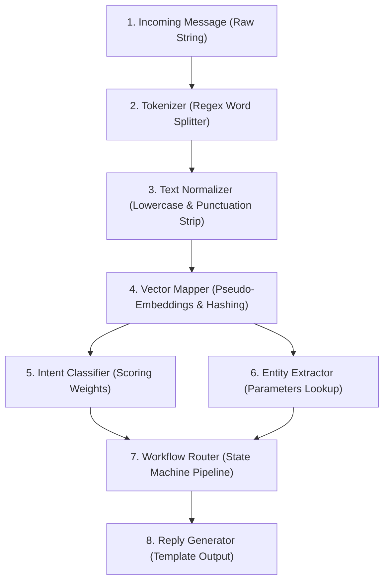

# NLP-Powered Chatbots: How AI Understands Messages

An open-source interactive learning resource created by **AI with Enoch** that explains how traditional chatbots understand what people type and respond in useful ways.

This project covers traditional NLP chatbots, LLM-powered chatbots, AI assistants, AI agents, and multi-agent systems. It shows how a chatbot can identify what a user wants, find important details in a message, use trusted information, follow workflows, and eventually take real-world actions through tools.

Built for the **Youth in AI Series: Practical AI Skills for Social Impact**.

⚡ **Live Demo Hosted on Vercel**: **[nlpchatbotsimulation.vercel.app](https://nlpchatbotsimulation.vercel.app)**

---

## 🗺️ How it Works: The NLP Pipeline

Unlike modern Generative AI models (like Gemini) which process text end-to-end using neural networks, traditional NLP systems process text step-by-step using a **modular pipeline**. 

This repository implements a lightweight client-side simulator of this pipeline using raw JavaScript.



---

## 🛠️ Step-by-Step Code Mechanics

Here is the exact JavaScript implementation running under the hood in **[app.js](app.js)** for each stage:

### Step 1: Receiving the Stream
The chatbot captures the text exactly as typed by the user and loads it into memory:
```javascript
const rawText = message; // e.g., "Hi, I want to join the event tomorrow."
```

### Step 2: Tokenization (Splitting Words)
The tokenizer cuts the text string into individual units called **tokens** using a regular expression that separates alphanumeric words (`\w+`) and punctuation marks (`[^\w\s]+`):
```javascript
const regexTokens = message.match(/\w+|[^\w\s]+/g) || [];
// Output: ["Hi", ",", "I", "want", "to", "join", "the", "event", "tomorrow", "."]
```

### Step 3: Text Normalization (Cleaning)
Capitalization and punctuation make words look different to a computer (e.g. `Join` vs `join!`). The cleaner lowercases all letters and strips punctuation:
```javascript
regexTokens.forEach(token => {
  const hasPunctuation = /^[^\w\s]+$/.test(token);
  let clean = token.toLowerCase();
  
  if (hasPunctuation) {
    clean = ""; // Strips commas, periods, etc.
  }
});
// Output: "hi i want to join the event tomorrow"
```

### Step 4: Words to Numbers (Vector Representation)
Computers calculate using numbers, not letters. The engine maps each word to a coordinate vector `[x, y, z]`. If the word is not in the built-in dictionary, it generates coordinates using a character code hashing algorithm:
```javascript
// Dictionary lookup
const wordDictionary = {
  "join": { embed: [0.12, 0.84, 0.31] },
  "event": { embed: [0.45, 0.18, 0.92] }
};

// Hashing fallback for unknown words
let h1 = 0, h2 = 0;
for (let i = 0; i < word.length; i++) {
  const charCode = word.charCodeAt(i);
  h1 = (h1 * 31 + charCode) % 100;
  h2 = (h2 * 37 + charCode) % 100;
}
const vector = [h1 / 100, h2 / 100, 0.5]; // coordinate floats
```

### Step 5: Intent Classification (Goal Prediction)
The engine checks the tokens list against keyword weight categories to calculate confidence scores for three main intents: **Registration**, **Pricing**, and **Location**:
```javascript
const registrationKeywords = ["join", "register", "attend", "signup"];
const pricingKeywords = ["cost", "price", "fee", "pay", "ticket"];
const locationKeywords = ["where", "location", "address", "venue", "map"];

let regScore = 0, prcScore = 0, locScore = 0;

lowercaseTokens.forEach(word => {
  if (registrationKeywords.includes(word)) regScore += 10;
  if (pricingKeywords.includes(word)) prcScore += 10;
  if (locationKeywords.includes(word)) locScore += 10;
});

// Normalize into percentages
const total = regScore + prcScore + locScore + 5;
const registrationPct = Math.round((regScore / total) * 90) + 5;
```

### Step 6: Entity Extraction (Parameters)
The engine extracts critical detail variables (Topic & Date) to parameterize the query:
```javascript
let extractedDate = "Not specified";
const dateWords = ["tomorrow", "today", "monday", "tuesday", "wednesday", "thursday", "friday"];
for (let word of lowercaseTokens) {
  if (dateWords.includes(word)) {
    extractedDate = word;
    break;
  }
}
```

### Step 7: Workflow State Machine Routing
Based on the predicted intent, the engine routes the variables to a structured decision-tree flowchart:
```javascript
if (winner === "Registration") {
  workflowSteps = [
    "Registration Request",
    "Ask for Full Name",
    "Ask for Email Address",
    "Save Registration",
    "Send Confirmation"
  ];
}
```

### Step 8: Reply Generation
A natural-language response string is compiled using templates filled with variables from the Entity stage:
```javascript
botReply = `Great! I can help you register for the ${extractedTopic}. Please send your name and email address.`;
```

---

## ⚡ Traditional NLP vs. Modern LLMs

Traditional NLP pipelines are **deterministic and modular**, whereas LLMs are **probabilistic and end-to-end**:

| Attribute | Traditional NLP (Used here) | LLM (e.g., Gemini) |
| :--- | :--- | :--- |
| **Logic** | Fixed pipeline modules. | Single giant neural network layers. |
| **Flexibility** | Rigid. Only matches trained words/intents. | Highly flexible. Understands slang, typos, context. |
| **Workflows** | Programmed state-machine flowcharts. | Autonomous reasoning and agent planning. |
| **Reliability** | 100% predictable. Never hallucinates. | Creative, but can make up facts (hallucination). |
| **Hosting Cost** | Low. Runs locally in a browser tab. | High. Requires GPU cloud processing. |

---

## 💻 Running the App Locally

Since the app is built entirely using front-end HTML/CSS/JS with zero external database dependencies:
1. Double-click the **[index.html](index.html)** file in your folder explorer to open it in Chrome, Edge, or Firefox.
2. Or launch a local web server to test:
   ```bash
   python -m http.server 8000
   ```
   Then open `http://localhost:8000` in your web browser.
3. Test using custom messages like:
   - *"How much does the ticket cost?"* (Triggers the Pricing intent and pricing workflow!)
   - *"Where is the workshop venue?"* (Triggers the Location intent and mapping workflow!)
   - *"Hi, I want to join the event tomorrow."* (Default path)
